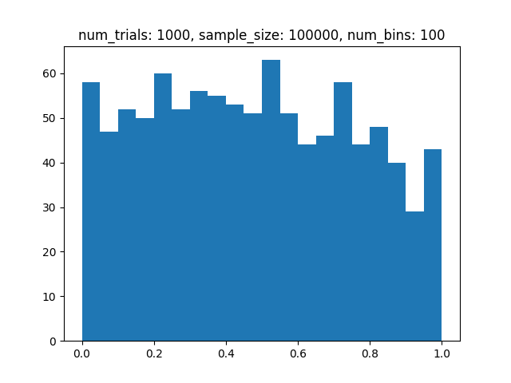
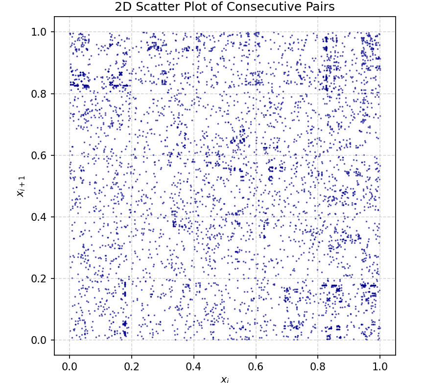
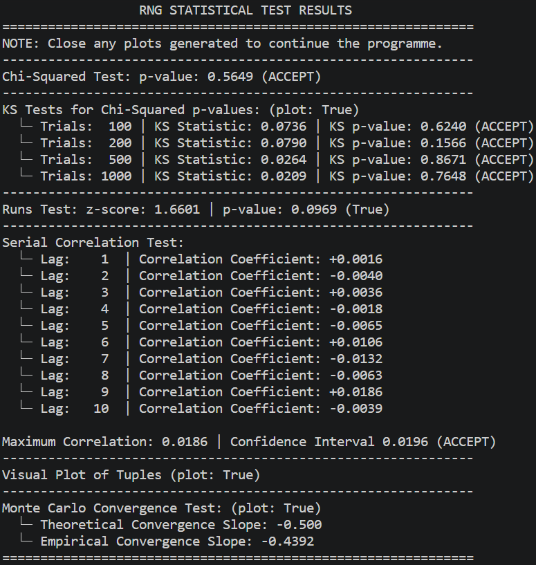
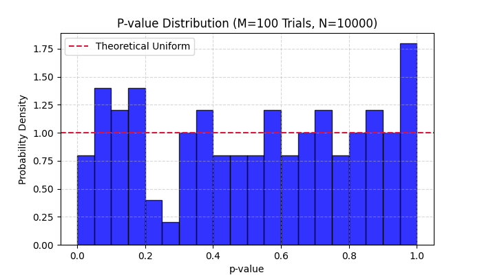
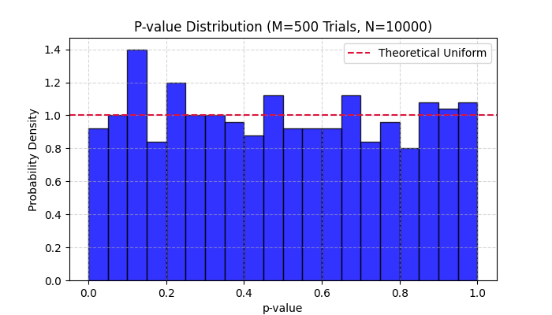
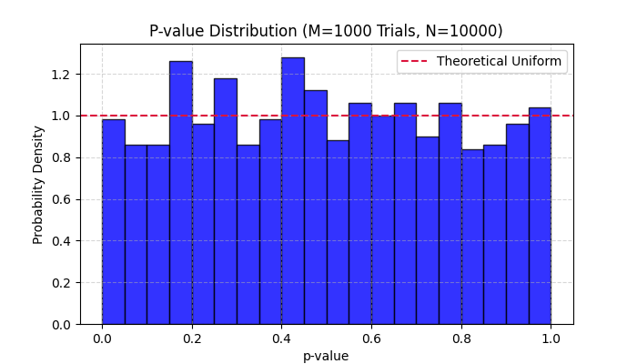
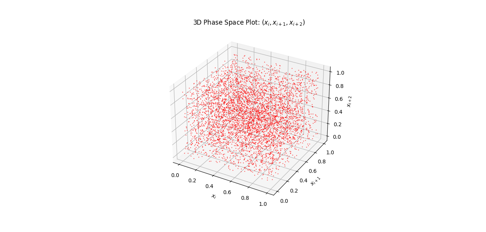
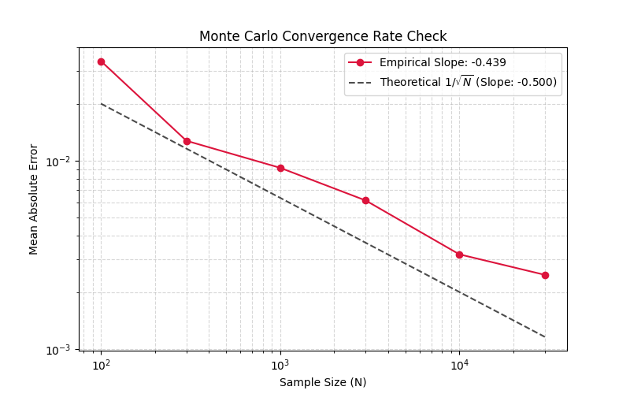

# Statistial test results of custom MT PRNG

## Changes while writing code:
Before updating the `Random` and `Test` classes, the generator failed several initial tests:

1. The Chi-squared test returned a very low p-value.
2. The p-value distribution dipped right at 1.

3. Changing the denominator to $2^{32}$ instead of $2^{32} - 1$ in `gen_nums()` to output numbers in the $[0, 1)$ interval did not fix the results.
4. A Kolmogorov-Smirnov (KS) test showed weak results ($D = 0.05$, $p = 0.08$).
5. The 2D scatter plot showed clear line banding, meaning values were repeating.

At first, I thought the generator was broken. 
Then, instatiating a single generator once in the `Random` and `Test` classes passed the tests. 
The problem was the generator was not holding its state since a new generator was instantiated when a sample was called. 
Using the numbers from a single generated for all samples ensures the numbers generated have the period of the MT. 

The following changes improved code performance: 
1. Generating a single sample for non-parametric and correlation tests to reduce memory and run less loops.
2. Using vectors to store and compute new data for the MC simulations.
3. Pre-allocating arrays to reduce memory. 

---
# Results

## Test 1: Chi-Squared
Checks numbers are generated uniformly by splitting the sample into equal-sized sub-intervals (bins). 

## Test 2: Kolmogorov-Smirnov (KS) Test
Checks if the p-values generated from the Chi-Squared test follows a Uniform[0, 1] distribution. 

A strong generator will have a small distance ($D$) and a high overall p-value. 
$D$ is the maximum vertical gap between the empirical distribution and the Uniform[0, 1] distribution. 
Clustering of p-values around: 
1. 0 - numbers are not generated uniformly.
2. 1 - numbers are generated perfectly uniformly. True randomness is messy hence we should expect some samples to have lower p-values.
3. 0.5 - the same sequence or overlapping subsequences are generated for each sample indicating an issue with how the state is being updated.

## Test 3: Serial Correlation
Checks for linear correlations between consecutive values in the sequence. 
That is, is the current random number $x_i$ correlated with the next $x_{i+1}$. 
Formally, this correlation is quantified by the lag-1 autocorrelation coefficient. 
For a strong generator, the serial correlation coefficient should be close to zero. 

Given a sample sequence of length $n$ with mean $\bar{x}$, the lag-1 autocorrelation coefficient $\rho_1$ is:
  
$$\rho_1 = \frac{\sum_{i=1}^{n-1} (x_i - \bar{x})(x_{i+1} - \bar{x})}{\sum_{i=1}^{n} (x_i - \bar{x})^2}$$
  
Under the null hypothesis that the sequence is independently generated, $\rho_1$ is asymptotically a $N \left(\frac{-1}{n - 1}, \frac{1}{n} \right)$ distribution. 

## Test 4: Runs Test
The Wald-Wolfowitz runs test checks the independence of sample values around the sample median. 

Data points are assigned "1" and a "0" if they lie above or below the median creating a binary sequence. 
Then, the number of "runs" (consecutive blocks of ones or zeros) is counted. 
Too few runs imply clustering while too many imply systematic oscillation around the mean. 

Now, we derive the expectation of the number of runs. 
Let $n_1$ be the number of elements above the median and $n_2$ be the number of elements below the median then $n = n_1 + n_2$.
The probability that two adjacent elements are different is 

$$p = \frac{2n_1n_2}{n(n-1)}.$$

Note we multiply by 2 since by symmetry, either a 0 can follow a 1 or a 1 can follow a 0. 

Now, let $I_k$ be an indicator variable equal to 1 if a switch occurs between position $k$ and $k+1$, and 0 otherwise. 
The total number of runs is $R = 1 + \sum_{k=1}^{n-1} I_k$. By the linearity of expecation, 

$$\text{E}(R) = 1 + (n-1)\left[\frac{2n_1n_2}{n(n-1)}\right] = \frac{2n_1n_2}{n} + 1.$$

For the variance,

$$\text{Var}(R) = \text{Var}\left(\sum_{k=1}^{n-1} I_k\right) = \sum_{k=1}^{n-1} \text{Var}(I_k) + 2 \sum_{j < k} \text{Cov}(I_j, I_k)$$

Now, since $I_k$ is a Bernoulli trial with probability $p$ calculated above, 

$$\text{Var}(I_k) = p(1 - p) = \left[\frac{2n_1n_2}{n(n-1)}\right] \left[1 - \frac{2n_1n_2}{n(n-1)}\right]$$

For the covariance terms, non-adjacent transitions are independent and have zero covariance. 
Meanwhile, there are $n - 2$ adjacent transitions share a common middle element and are dependent. The covariance of each of these adjacent transitions is:

$$\text{Cov}(I_k, I_{k+1}) = \text{E}(I_k I_{k+1}) - \text{E}(I_k)\text{E}(I_{k+1}) = \frac{n_1n_2}{n(n-1)} - \left[\frac{2n_1n_2}{n(n-1)}\right]^2$$

Substituting the above into the equation for the variance yields: 

$$\text{Var}(R) = (n-1)p(1-p) + 2(n-2)\left[ \frac{n_1n_2}{n(n-1)} - p^2 \right].$$

Lastly, substituting $p$ gives: 

$$\text{Var}(R) = \frac{2n_1n_2}{n} - \frac{4n_1^2n_2^2}{n(n-1)} + \frac{2(n-2)n_1n_2}{n(n-1)} - \frac{8(n-2)n_1^2n_2^2}{n^2(n-1)^2} = \frac{2n_1n_2(2n_1n_2 - n)}{n^2(n - 1)}.$$

## Test 5: 2D/3D Plot
Plots consecutive sample values as different co-ordinates. 

For a strong generator, in two dimensions a uniformly filled in square should be plotted. 
This allows the user to quickly evaluate serial correlation and runs tests above visually. 

Distinct banding, clustering or empty spaces indicate the state sequence of the generator is repeating. 
This causes the period of each generated number to be smaller than the MT period. 

## Test 6: Monte Carlo (MC) Error Convergence
Consider estimating the area of a quarter circle of radius 1 inside a unit square. 
Clearly, area of the quarter circle is $I = \pi / 4$. 
We generate independent coordinate pairs $(x\_i, y\_i) \sim U(0,1) \times U(0,1) $ from the stream and check if $x\_i^2 + y\_i^2 \leq 1$. 
This is equivalent to dropping a needle on the unit square and finding the probability it lands inside the quarter circle. 

The estimator is the sample mean:

$$\hat{I}\_n = \frac{1}{N}\sum_{i=1}^N \mathbb{1}_{\{x_i^2 + y_i^2 \leq 1\}}.$$
  
Now, we will derive why the theoretical slope is -0.5.
Since each random point is an independent Bernoulli trial, the variance of the estimator scales directly with the sample size: 

$$\text{Var}(\hat{I}_N) = \frac{\sigma^2}{N}$$, 

where $\sigma^2$ is the variance of a single trial. 
By the CLT, the Mean Absolute Error (MAE) is proportional to the standard deviation of our estimator:

$$\text{MAE} = \text{E}[|\hat{I}_N - I|] \propto \frac{\sigma}{\sqrt{N}} = \sigma N^{-0.5}.$$

Taking logs on both sides yields: 

$$\ln(\text{MAE}) = -0.5 \ln(N) + \ln(\sigma).$$
  
Hence, fitting a linear regression line to our log-log error curve should yield an empirical slope close to $-0.5$. 

Otherwise, this implies a problem in how numbers are generated uniformly and independently as the sample size increases.
